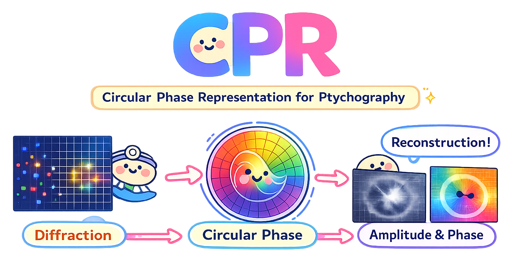

# Circular Phase Representation for Ptychographic Reconstruction

<p align="center">
  
</p>

Official PyTorch implementation of **Circular Phase Representation and
Geometry-Aware Optimization for Ptychographic Image Reconstruction**, with
support for simulated AD_LTEM and experimental X-ray ptychography data.

Carson Yu Liu, Jun Cheng, Chien-Chun Chen, and Steve F. Shu

[[arXiv]](https://arxiv.org/abs/2604.26664)
[[PDF]](https://arxiv.org/pdf/2604.26664)

## Quick start

```bash
git clone https://github.com/carson-liu/CPR.git
cd CPR

python -m venv .venv
source .venv/bin/activate
pip install -r requirements.txt

python main.py --mode generate --seed 0
python main.py
```

The final command evaluates the included pretrained AD_LTEM checkpoint at
`checkpoints/ad_ltem/best_model.pth`.

## Demo

After generating the AD_LTEM data, launch the pretrained notebook demo with:

```bash
jupyter notebook demo.ipynb
```

## Data sources

### AD_LTEM simulation

The simulated dataset is based on the modified 1951 USAF resolution chart
from [AD_LTEM](https://github.com/danielzt12/AD_LTEM). The source images and
probe used by this repository are included under `simulation/assets/`.

Generate the six arrays used by CPR:

```bash
python main.py --mode generate --seed 0
```

The default simulation uses a `512 x 512` object, `75%` probe overlap, a
`32 x 32` probe, positional jitter, and Gaussian plus Poisson noise. It writes:

```text
75_diff.npy       75_diff_n.npy
75_amp.npy        75_amp_n.npy
75_ph.npy         75_ph_n.npy
```

The normalized `_n.npy` arrays are used for AD_LTEM training and testing.

### Experimental X-ray data

The experimental dataset is the tungsten-pattern dataset from
[PtychoNN](https://github.com/mcherukara/PtychoNN), acquired at the Advanced
Photon Source sector 26. The official files are hosted in the
[PtychoNN_data dataset](https://huggingface.co/datasets/mcherukara/PtychoNN_data/tree/main).

Download the two required files into the repository root:

```bash
curl -L "https://huggingface.co/datasets/mcherukara/PtychoNN_data/resolve/main/20191008_39_diff_reduced.npz?download=true" \
  -o 20191008_39_diff_reduced.npz
curl -L "https://huggingface.co/datasets/mcherukara/PtychoNN_data/resolve/main/20191008_39_amp_pha_10nm_full.npy?download=true" \
  -o 20191008_39_amp_pha_10nm_full.npy
```

Experimental diffraction, amplitude, and phase are processed in their
original values without input normalization or output denormalization.

The experimental global reconstruction uses its own geometry: each `64 x 64`
patch contributes its central `18 x 18` region with a three-pixel scan step.
Overlapping values are averaged, borders are cropped, and the result is resized
to `60 x 60`. AD_LTEM instead uses adaptive weighted stitching.

## Training and testing

A pretrained checkpoint is included for AD_LTEM only. Experimental data must
be downloaded and trained before running experimental test mode.

```bash
# AD_LTEM (default dataset)
python main.py --mode train
python main.py --mode test

# Experimental data (no pretrained experimental checkpoint is included)
python main.py --dataset experimental --mode train
python main.py --dataset experimental --mode test
```

Both datasets train for 25 epochs by default. Checkpoints and generated results
are saved under `checkpoints/<dataset>/` and `results/<dataset>/`.

## Repository structure

```text
.
├── main.py                       # train, test, or generate data
├── demo.ipynb                   # pretrained AD_LTEM demo
├── checkpoints/
│   └── ad_ltem/                  # included pretrained checkpoint
├── assets/
│   └── cpr_flag.png              # project banner
├── datasets/
│   ├── ad_ltem.py                # AD_LTEM data and split
│   └── experimental.py           # experimental data and split
├── models/
│   ├── cpr.py                    # CPR network and SADGS
│   └── loss.py                   # circular phase loss
├── simulation/
│   ├── assets/                   # amplitude, phase, and probe
│   └── ptychography.py           # forward simulation
├── utils/
│   ├── inference.py
│   ├── metrics.py
│   ├── stitching.py              # dataset-specific stitching
│   ├── training.py
│   └── visualization.py
└── requirements.txt
```

## Citation

```bibtex
@article{liu2026circular,
  title={Circular Phase Representation and Geometry-Aware Optimization for Ptychographic Image Reconstruction},
  author={Liu, Carson Yu and Cheng, Jun and Chen, Chien-Chun and Shu, Steve F.},
  journal={arXiv preprint arXiv:2604.26664},
  year={2026}
}
```

## License

MIT License. See [LICENSE](LICENSE).
